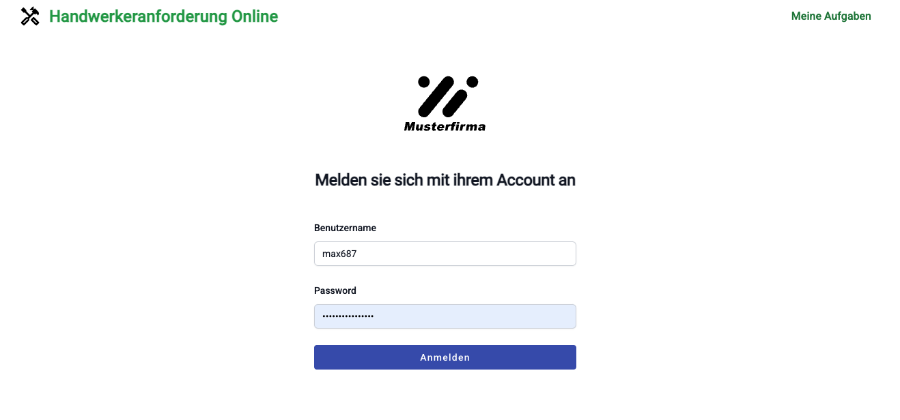
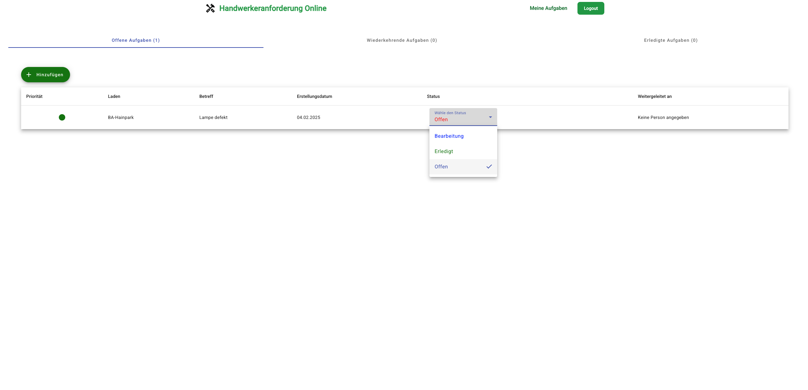
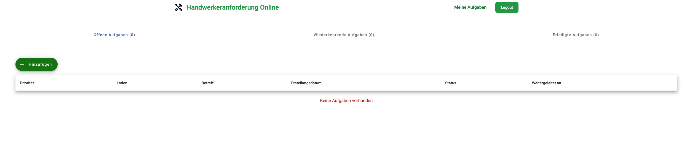
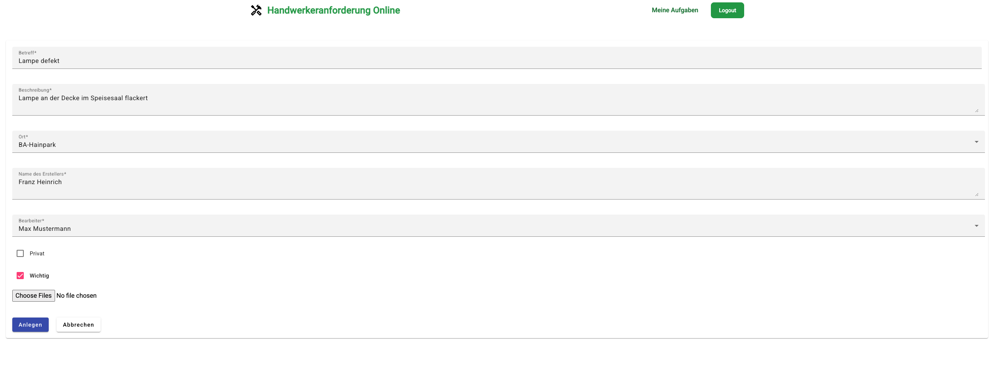
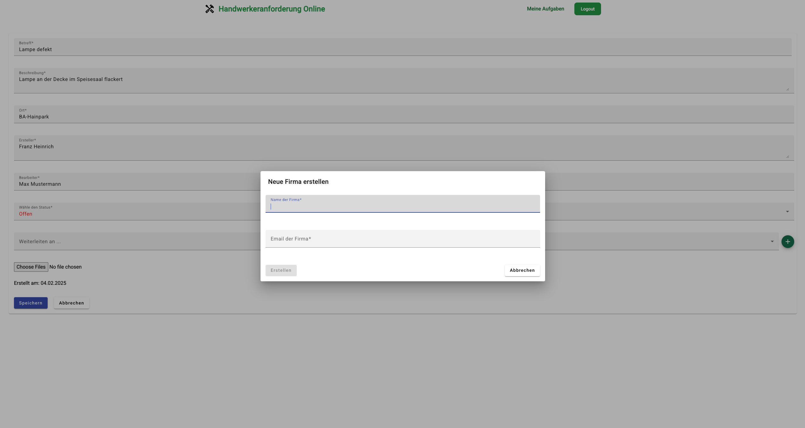

# Frontend Application for Taskmanagement-Online 📝

This is an **Angular-based online management system** designed to streamline task management for craftsmen. This system allows companies to create tasks for problems they face, which can then be assigned to a craftsman.

## **Preview** 👀

Here’s a quick look at the application in action. These images highlight the key features and interface of the app:

### **Authentication**
*A _modern_ login page.*  


### **Dashboard**
*Upon logging in, you arrive at the **main dashboard**. The table provides a concise overview of your assigned tasks, including all essential details. Tasks are tracked by status, which can be quickly changed via a dropdown menu integrated directly into the table. No need to save manually – it's all handled automatically!* 😉
*Clicking on a task will directly open and display the attached photos associated with it.*



### **Task Creation**
*Creating tasks is straightforward using a simple form. The **private** option allows for personal or confidential task creation, while the **important** checkbox flags urgent tasks. When marked as important, the task will be highlighted with a red dot in the task list on the dashboard.*  


### **Company Creation**
*For tasks outside your specialty (e.g., networking), you can create a profile for a company you collaborate with. Simply enter their name and email address. Once registered, you can easily assign tasks to the company by forwarding the relevant task.*  


---

## **Table of Contents**
1. [About the Project](#about-the-project)
2. [Features](#features-)
3. [Tech Stack](#tech-stack-)
4. [Installation](#installation-)
5. [Contributing](#contributing-)
6. [License](#license-)

---

## **About the Project**

The **Taskmanagement-Online** frontend brings a user-friendly interface for managing tasks, assigning craftsmen, and monitoring progress. Seamlessly integrated with a robust backend, it provides business users an efficient platform to manage operations. You can find the corresponding backend in my [other repository](https://github.com/XToodyX/taskmanagement-backend)

## **Purpose of the Project** 🎯

This project aims to provide an efficient and intuitive web-based platform tailored for managing tasks within companies and enhancing collaboration among craftsmen. By simplifying task assignment, tracking, and progress monitoring, it helps businesses streamline their workflows while ensuring important details like task priorities, attachments, and private entries are well-managed. With a secure and user-friendly interface, the application promotes better organization and communication between teams, boosting overall productivity.

---

## **Features** ✨

**Task Management:**  
Create, view, edit, and delete tasks with ease.

**Craftsman Assignment:**  
Assign craftsmen to specific tasks and efficiently track their progress.

**Responsive UI:**  
Built with **Angular Material** and **TailwindCSS** for a clean, modern design.

**Authentication:**  
Supports secure login and logout (JWT-ready integration).

**Real-Time Updates:**  
Dynamic updates between task statuses and user actions.

**Simple Structure:**  
Maintain a clear and organized layout for all tasks.

**File Attachments:**  
Add and store related pictures or files in tasks for better context.

**Task Prioritization:**  
Highlight and prioritize important tasks to focus on what matters most.

**Forward Tasks:**  
Forward tasks to other companies for collaboration or additional support.

**Private Tasks:**  
Create and manage private tasks visible only to authorized users for sensitive work.

**Secure Routing:**  
Restricted access to certain routes, sites, or functionality to protect against unauthorized users.

**Error Handling:**  
Provides clear and user-friendly error feedback through pop-up banners, ensuring a smooth user experience and quick resolution of issues.

---

## **Tech Stack** ⚙️

This project is built on the following technologies:

- **Frontend Framework**: Angular 17.0.0
- **Styling**: TailwindCSS and Angular Material
- **Language**: TypeScript 5.2.2
- **Linting & Formatting**: ESLint and Prettier

---

## **Installation** 🛠️

### Prerequisites

Before you begin, make sure you have the following installed:
- **Node.js**: `>= 18.0.0`
- **npm**: `>= 9.0.0`
- **Angular CLI**: `17.0.0`

Verify the installed versions using:

```bash
node -v
npm -v
ng version
```

---

### Steps to Install and Run Locally

1. Clone the repository:
   ```bash
   git clone https://github.com/XToodyX/taskmanagement-frontend.git
   cd taskmanagement-frontend
   ```

2. Install dependencies:
   ```bash
   npm install
   ```

3. Run the application in development mode:
   ```bash
   npm run start
   ```  

   The app will be available at [http://localhost:4200](http://localhost:4200).

---

### Build for Production:

To generate a production-ready version of the app:
```bash
npm run build
```

The production files will be built in the `/dist` folder.

---

## **Contributing** 👨🏼‍💻

We are open to contributions! Here's how you can contribute:

1. Fork the repository.
2. Create a new branch for your feature:
   ```bash
   git checkout -b feature/your-feature
   ```
3. Make your changes and test them.
4. Commit your changes:
   ```bash
   git commit -m 'Add feature: your-feature'
   ```
5. Push to your branch:
   ```bash
   git push origin feature/your-feature
   ```
6. Open a Pull Request and explain your feature.

---

## **License** ⚖️

Distributed under the **MIT License**. See `LICENSE` for more information.

---
